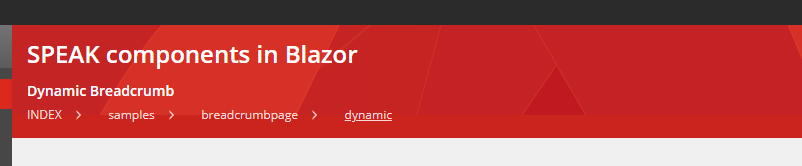

# SitecoreBlazorUI
The repository contains the source code for SitecoreBlazorUI which is an **experimental** and **community-driven** project.

The purpose of this module to have Sitecore [SPEAK3 components](https://doc.sitecore.com/developers/speak/90/speak/en/speak-3.html) on Blazor.

This is a **work in progress** application, **You can use it, but its at your own risk**.
Stylesheets and icons have been reused from [Sitecore's official npm feed.](https://sitecore.myget.org/gallery/sc-npm-packages)

Please feel free to contribute or raise an issue if you have any!

# Prerequisites
- You need to have a Visual Studio 2019 installed
- You need to have the .NET SDK 3.1 installed

## Setting up the project
- Clone this repository
- navigate into the src folder and type in the command prompt the following command: '**dotnet run**'
- Open the application in your preferred browser on **http://localhost:5000**

## Publishing to Sitecore
- You can follow the  instructions from this [blog post](https://medium.com/@mitya_1988/using-blazor-for-sitecore-custom-applications-1618fb11f301)

### Re-written components
Note: The following components may not have the full functionality from SPEAK3

#### ScIcon

ScIcon can display any icons which exists in the icon library.

Sample Page http://localhost:5000/samples/iconpage

```
 <ScIcon Icon="about" Title="about" Size="xl" />
```


#### ScActionBar
ScActionBar creates an action bar on the page. It has a left aligned and right aligned placeholder to place controls.

Sample Page: http://localhost:5000/samples/actionbarpage
```
   <ScActionBar>
        <ScActionBarLeft>
            <ScBackButton/>
            <ScButton ButtonType="primary" Text="Action Bar Left"/>
        </ScActionBarLeft>
        <ScActionBarRight>
            <ScButton ButtonType="secondary" Text="Action Bar Right"/>
        </ScActionBarRight>
    </ScActionBar>
```


#### ScButton
ScButton creates a button in different variants. 

Sample Page: http://localhost:5000/samples/buttonpage
```
   
<ScButton ButtonType="primary" Text="Primary" OnClickCallback="ClickTest" />
<ScButton ButtonType="secondary" Text="Secondary" />
<ScButton ButtonType="info" Text="Info" />
<ScButton ButtonType="link" Text="Link" />
<ScButton ButtonType="chromeless" Text="Chromeless" />
```

#### ScBackButton
ScBackbutton is a special button which allows you navigate back in browser history;

Sample Page: http://localhost:5000/samples/buttonpage
```
  <ScBackButton/>
```


#### ScButtonGroup
It allows you to group the buttons
```
<ScButtonGroup>
    <ScButton ButtonType="primary" Text="Primary 1" OnClickCallback="ClickTest" />
    <ScButton ButtonType="primary" Text="Primary 2" OnClickCallback="ClickTest" />
    <ScButton ButtonType="primary" Text="Primary 3" OnClickCallback="ClickTest" />
</ScButtonGroup>
```

#### ScExpander
ScExpander allows you to add collapsible content to your page

Sample Page: http://localhost:5000/samples/expanderpage
```
 <ScExpander HeaderTitle="Closed by Default" IsOpened="false">
    <h2>closed</h2>
</ScExpander>
```


#### ScApplicationHeader
ScApplication header can add the red colored header to each page with title and subtitle
```
 <ScApplicationHeader Text="SPEAK components in Blazor">
    <h5 class="basic-white">Buttons</h5>
</ScApplicationHeader>
```


#### ScGlobalHeader and ScGlobalLogo
ScGlobalHeader and ScGlobalLogo defines the global header for application which can be shared across each pages.
```
<ScGlobalHeader PageTitle="This is the page title" ApplicationTitle="SitecoreBlazorUI">
    <ScGlobalLogo RedirectUrl="/home/" />
</ScGlobalHeader>
```


#### ScMenu, ScMenuCategory, ScMenuItem
By using these controls you can build Sitecore themed navigation easily and you can group the different menu items.
```
<ScMenu>
    <ScMenuCategory CategoryTitle="First" IsOpened="true" Icon="cake_slice">
        <ScMenuItem Href="/"> Home</ScMenuItem>
        <ScMenuItem Href="samples/textpage">Headings</ScMenuItem>
        <ScMenuItem Href="samples/tabpage">Tabs</ScMenuItem>      
    </ScMenuCategory>
    <ScMenuCategory CategoryTitle="Closed by Default" IsOpened="false" Icon="about">
        <ScMenuItem Href="samples/textcolorspage">Text Colors</ScMenuItem>
    </ScMenuCategory>
</ScMenu>
```


#### ScMessageBar and ScAlert
You can define alert message in different variants.

http://localhost:5000/samples/messagepage
```
<ScMessageBar>
    <ScAlert Variant="danger" Text="Hello" />
</ScMessageBar>
<ScMessageBar>
    <ScAlert Variant="warning" Text="Hello" />
</ScMessageBar>
<ScMessageBar>
    <ScAlert Variant="info" Text="Hello" />
</ScMessageBar>
<ScMessageBar>
    <ScAlert Variant="success" Text="Hello" />
</ScMessageBar>

```


#### ScProgressBar and ScProgressIndicator

Sample Page: http://localhost:5000/samples/progresspage

```
  <ScProgressIndicator Show="true"/>
  <ScProgressBar Value="40" />

```

#### ScTab
You can seperate your content into tabs. Tabs control supports multiple variants(switch, progressive, sub) and support disabling a given tab.

Sample Page: http://localhost:5000/samples/tabpage
```
 <ScTabGroup Variant="switch">
    <ScTab Text="Tab 1">
        <h1>The first tab</h1>
    </ScTab>
    <ScTab Text="Tab 2">
        <h1>The second tab</h1>
    </ScTab>
    <ScTab Text="Tab 3" IsDisabled="true">
        <h1>Disabled by default</h1>
    </ScTab>
</ScTabGroup>

```


#### ScTable
ScTable creates Sitecore SPEAK themed tables. 

Sample Page: http://localhost:5000/samples/tablepage


```
<ScTable>
    <thead>
        <tr>
            <th>#</th>
            <th>First Name</th>
            <th>Last Name</th>
        </tr>
    </thead>
    <tbody>
        <tr>
            <td>1</td>
            <td>Mark</td>
            <td>Otto</td>
        </tr>
        <tr>
            <td>2</td>
            <td>Jacob</td>
            <td>Thornton</td>
        </tr>
    </tbody>
</ScTable>

```


#### ScModal
ScModal allows to create and display modal dialogs in different tyles

Sample Page: http://localhost:5000/samples/modalpage


```
<ScModal @ref="Modal7" 
    DialogType="ScModal.ModalType.Error" 
    ModalTitle="Click modal" 
    DialogSize="ScModal.ModalSize.Large" 
    ShowBackdrop="true" 
    CloseBtnText="Cancel" 
    BtnText="Save" 
    OnBtnClickCallback="ClickTest">
        <h4>Lorem ipsum</h4>
        Modal with backdrop.
</ScModal>

```


#### ScBreadcrumbs
ScBreadcrumbs allows to create and display static and dynamic (based on the request path) breadcrumbs on the page

Sample Page (dynamic): http://localhost:5000/samples/breadcrumbpage/dynamic

Sample Page (static): http://localhost:5000/samples/breadcrumbpage

**Static Sample**

(Note: You have to ScBreadcrumb component within the **ScApplicationHeader** component)

```
<ScApplicationHeader Text="SPEAK components in Blazor">
    <h5 class="basic-white">Static Breadcrumb</h5>
    <ScBreadcrumb>
        <ScBreadcrumbItem Href="/">Home</ScBreadcrumbItem>
        <ScBreadcrumbItem Href="/">Level1</ScBreadcrumbItem>
        <ScBreadcrumbItem Href="/">Level2</ScBreadcrumbItem>
    </ScBreadcrumb>
</ScApplicationHeader>

```

**Dynamic Sample**

(Note: If **IsDynamic** property set to 'true', any child element of **ScBreadcrum** component will be ignored and wont be rendered)

```
<ScApplicationHeader Text="SPEAK components in Blazor">
    <h5 class="basic-white">Dynamic Breadcrumb</h5>
    <ScBreadcrumb IsDynamic="true" RootItemTitle="Index">
    </ScBreadcrumb>
</ScApplicationHeader>

```

